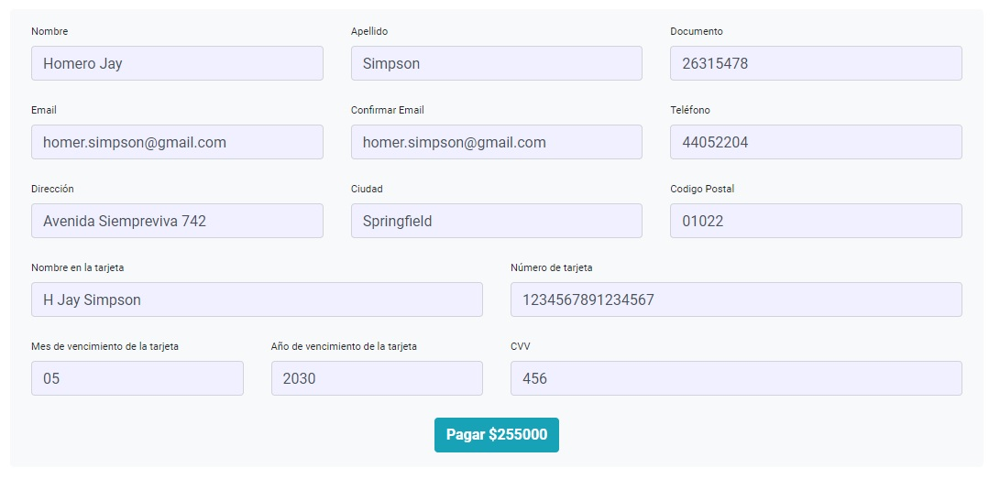

<!-- PROJECT LOGO -->
<br />
<p align="center">
  <a href="#">
    
  </a>

  <h3 align="center">CompumundoHyperMegaRed</h3>

  <p align="center">
    La mejor calidad, al mejor precio.
    <br />
    <a href="https://github.com/GermanDenaro/CompumundoHiperMegaRed-Denaro/blob/main/README.md"><strong>Ver el documento »</strong></a>
    <br />
    
  </p>
</p>

<!-- ABOUT THE PROJECT -->

## Sobre el proyecto

Este es mi proyecto final para el curso de ReactJs de [CoderHouse](https://www.coderhouse.com/)

CompumundoHyperMegaRed es una tienda virtual de venta de productos electrónicos. Recibimos importaciones de los paises mas influyentes del mundo, para asegurar la calidad y felicidad de nuestros clientes.

### Hecho con:

- [React](https://reactjs.org/)
- [Bootstrap](https://getbootstrap.com)
- [React-Bootstrap](https://react-bootstrap.github.io/)
- [Formik](https://formik.org/)
- [MaterialUi-Icons](https://material-ui.com/es/components/material-icons/)

<!-- GETTING STARTED -->

## Empecemos!

### requisitos

- ```sh
  Ganas de probar mi pagina.
  ```

<!-- USAGE EXAMPLES -->

## Uso de la Pagina

La lista de los productos.


El item seleccionado en detalle. Clickeamos en agregar al carrito.
<br />
Si queremos seguir comprando, clickeamos en Volver y si ya terminamos, clickeamos en Finalizar Compra.


Este es tu carrito. Aqui veras todos los productos que agregaste, asi como su cantidad y su precio total.
<br />
Tambien, podes eliminar algun producto clickeando en el tacho rojo.
<br />
Si todo esta bien, clickeamos en Checkout


Aqui tenemos un formulario, el cual completaremos con nuestros datos.
<br />
Al terminar, clickearemos en Pagar.


Y listo! Revisa tu E-mail para tu confirmación!


<!-- LICENSE -->

## Licencia

Sientanse libre de hacer lo que quieran con este proyecto.

<!-- CONTACT -->

## Contacto

Germán Denaro - [LinkedIn](https://www.linkedin.com/in/germandenaro/)

Link del Proyecto: [https://github.com/GermanDenaro/CompumundoHiperMegaRed-Denaro](https://github.com/GermanDenaro/CompumundoHiperMegaRed-Denaro)

<!-- ACKNOWLEDGEMENTS -->

## Gracias a:

- [MercadoLibre](https://www.mercadolibre.com.ar/)
- [Animate.css](https://daneden.github.io/animate.css)
- [Google Fonts](https://fonts.google.com/)
